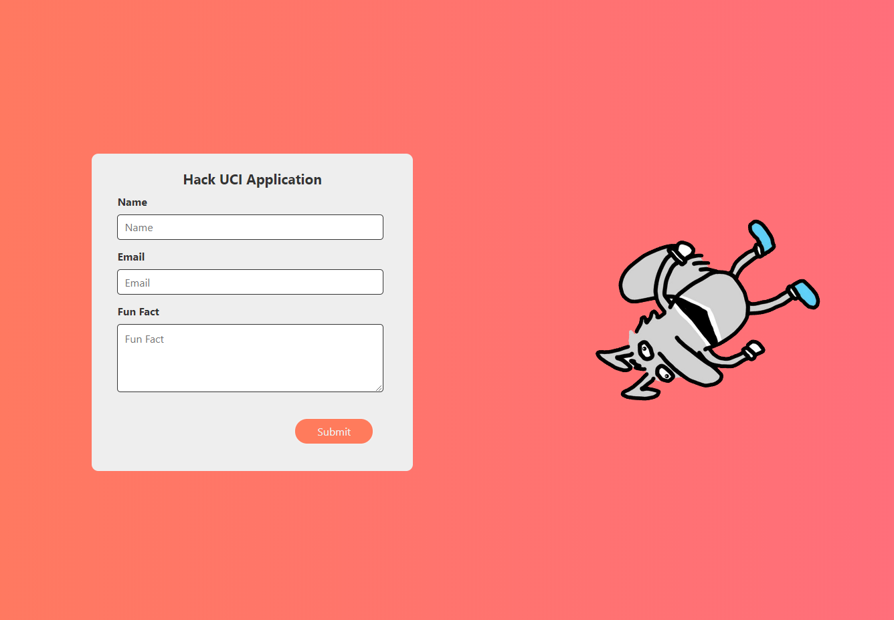
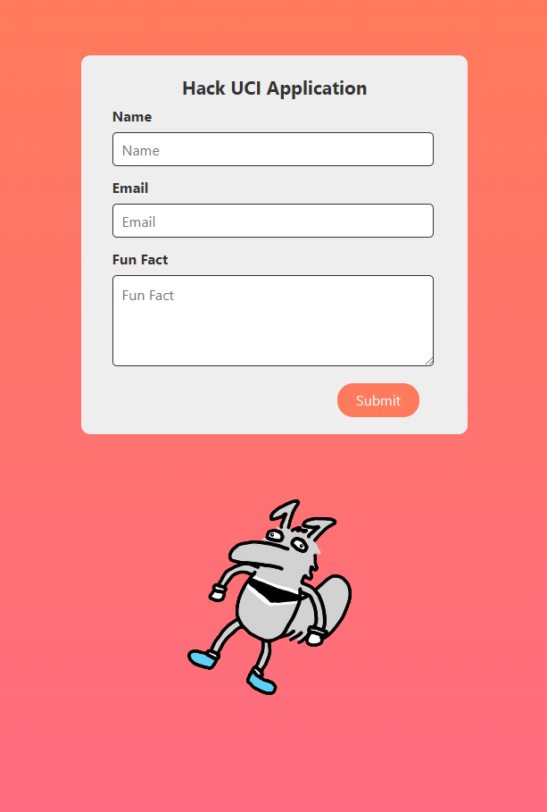

# HackUCI - Startpage

## Setup 
Startpage for HackUCI's technology board application.

## Installation
In the project directory, run:\
`npm start`\
to start the app in the development mode.\
Open http://localhost:3000/ to view it in the browser.\

## Built With
- [ReactJS](https://reactjs.org/)
- [ReactToastify](https://www.npmjs.com/package/react-toastify)

## Walkthrough

## Prompt
- [Prompt](https://www.notion.so/Hack-at-UCI-Tech-Team-Deliverable-2021-2022-dab4a6d0d6e24a81a54631894df8f71f)
