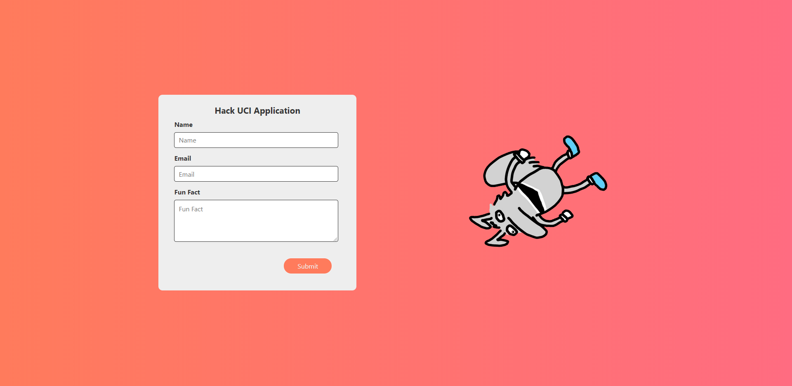
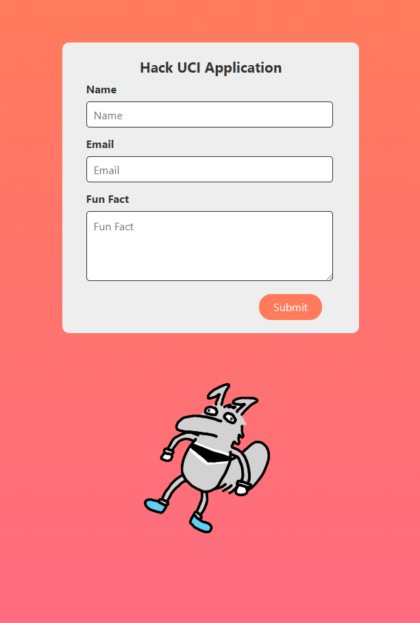

# HackUCI - Startpage

## Setup 
A simple startpage for HackUCI's technology board application.

## Installation
In the project directory (hackuci-deliv/startpage), you can run:\
`npm start`\
to start the app in the development mode.\
Open http://localhost:3000/ to view it in the browser.\

## Built With
- [ReactJS](https://reactjs.org/)
- [ReactToastify](https://www.npmjs.com/package/react-toastify)

## Walkthrough

## Prompt
- [Prompt](https://www.notion.so/HackUCI-Tech-Team-Deliverable-e31d10cc364e4357b6bb9a581e4244c2)
